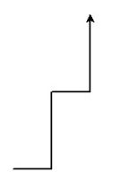
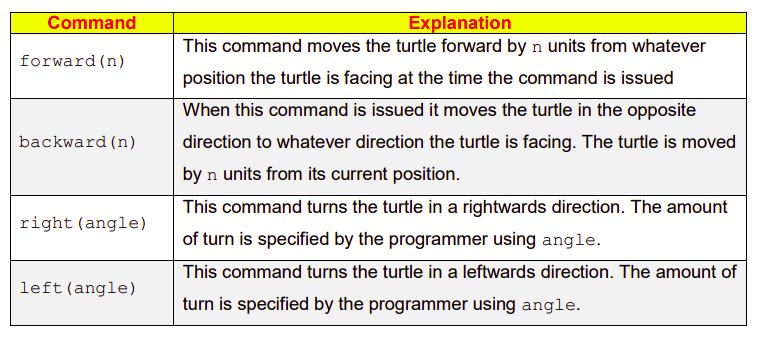

# Instructions  
Turtle graphics is a popular way for introducing programming to novice programmers. It was part of the original Logo programming language developed by Wally Feurzig and Cynthia Solomon in consultation with Seymour Paper in 1966.

The movements of the turtle graphic object can be compared to the movements that you would see if you were looking down at a real turtle inside a rectangular shaped box. The program below causes the shape / pattern shown in the white box to be drawn.


````python
from turtle import *


forward(100) # move forward 100 units
left(90)     # turn left by 90 degrees
forward(100)
right(45)
forward(50)
left(90)
forward(100)
````

## Program Explanation 
- Line 1 tells Python to import a library called ‘turtle’. A library can be thought of as an external Python program that contains useful code. ``from`` and ``import`` are two Python keywords. When a library is imported into a program the functionality of that library can then be used in that program.
- The commands on lines 8 to 14 inclusive instruct Python to move the turtle forward and turn it left/right until the shape is drawn.

  ## Suggested Activities
1. Read lines 8 - 14 of the program and see if you can figure out how the shape is created.
2. Type the program in and run it. *(Warning! Do not save the program as turtle.py)*
3. Insert comment on lines 10 – 14 inclusive. *(Lines 8 and 9 are already commented.)*
4. Rearrange lines 8 - 14 into different orders and see if you can explain the change in output. You can delete some lines if you wish.
5. Experiment with the numbers used on lines 8 – 14 until you understand what they mean. For example, you could change 100 to 50 on line 8, or change 90 to 45 on line 13.
6. Modify the program so that it displays the following image


## Common movement commands
Some more common movement commands supported by the ``turtle`` library are oulined below


## For more Turtle Movements
Check out the official docs here -
[Turtle Graphics](https://docs.python.org/3/library/turtle.html)


