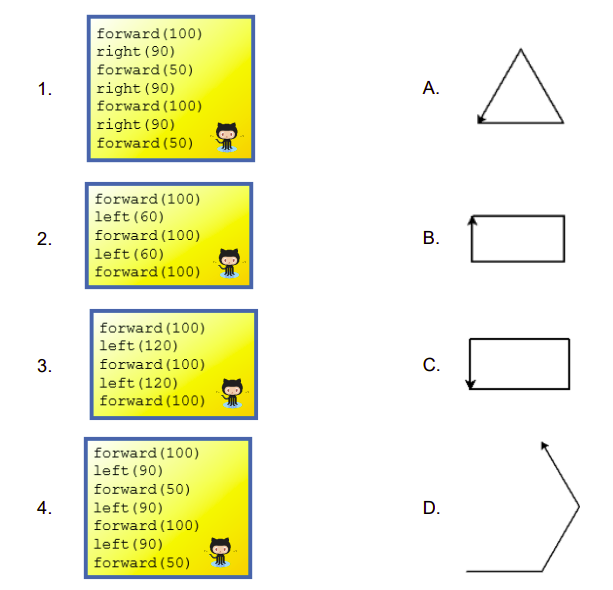
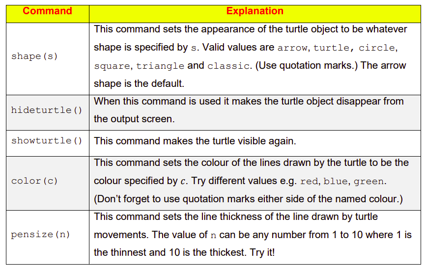

# Instructions  
The default starting position for the ``turtle`` is the centre of the screen with an arrow pointing to the right *(i.e. east).* It is up to the programmer to keep a track of the position of the turtle on the screen and the direction it is facing. 

The best way to learn how to use ``turtle`` is to experiment. The following exercise might help.


  ## Tasks
Before running any of the above blocks of code, you will need to add the line ``from turtle import *`` before the turtle commands in ``main.py``.

1. Predict and match which block of code matches with each shape A, B, C or D.



2. To demonstrate that your answers are correct, type up and run
   each of the separate code blocks below.
  ```python
# 1
forward(100)
right(90)
forward(50)
right(90)
forward(100)
right(90)
forward(50)
```
````python
# 2
forward(100)
left(60)
forward(100)
left(60)
forward(100)
````
````python
# 3
forward(100)
left(120)
forward(100)
left(120)
forward(100)
````

````python
# 4
forward(100)
left(90)
forward(50)
left(90)
forward(100)
left(90)
forward(50)
````
3. The commands listed below can be used to change the appearance of turtle objects




  
