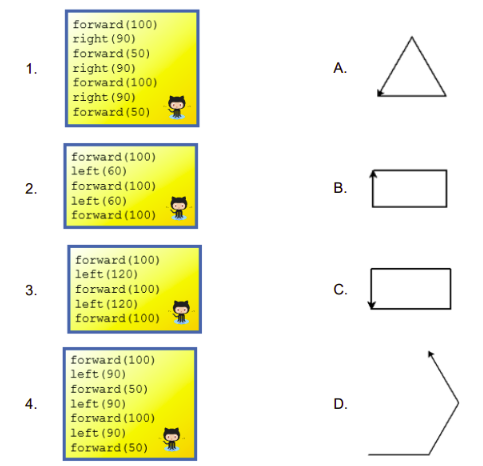

# Turtle Graphics 🐢


### Python with Turtle lets you make graphics easily in Python.

This is the Template Repl for Python with Turtle.
> Run the code below in `main.py`

````py
# import the turtle library
import turtle

# Run this code to create a colourful square
t = turtle.Turtle()

for c in ['red', 'green', 'blue', 'yellow']:
    t.color(c)
    t.forward(75)
    t.left(90)
````

For more detailed information, check out the official docs [here](https://docs.python.org/3/library/turtle.html)


## Basic drawing ✍🏽

1. Send the turtle forward 100 steps:

````py
turtle.forward(100)
````
- You should see (most likely, in a new window on your display) a line drawn by the turtle, heading East.
  
2. Change the direction of the turtle, so that it turns 120 degrees left (anti-clockwise):
````py
turtle.left(120)
````
3. Let’s continue by drawing a triangle:
````py
turtle.forward(100)
turtle.left(120)
turtle.forward(100)
````
- Notice how the turtle, represented by an arrow, points in different directions as you steer it.

- Experiment with those commands, and also with:
````py
turtle.backward()

turtle.right()
````

## Pen control 📝
1. Try changing the colour - for example:
````py
turtle.color('blue')
````
2. Try changing the width of the line - for example:
````py
turtle.width(3)
````
...and try drawing again.


3. You can also move the turtle around without drawing, by lifting up the pen before moving.
````py
turtle.up()
````
  - To start drawing again, use...
````py
turtle.down()
````

## The Turtle’s position 🐢
Send your turtle back to its starting-point (useful if it has disappeared off-screen):

````py
turtle.home()
````
The home position is at the center of the turtle’s screen. 
If you ever need to know them, get the turtle’s x - y coordinates with:
````py
turtle.pos()
````
Home is at ``(0, 0)``.

And after a while, it will probably help to clear the window so we can start anew:
````py
turtle.clearscreen()
````

## Predict & Match
1. Predict and match which block of code matches with each shape A, B, C or D.
2. Compare your predictions with your classmates.


